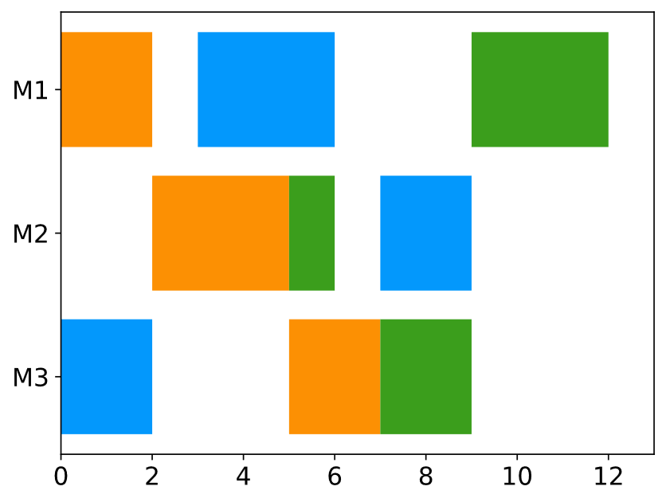
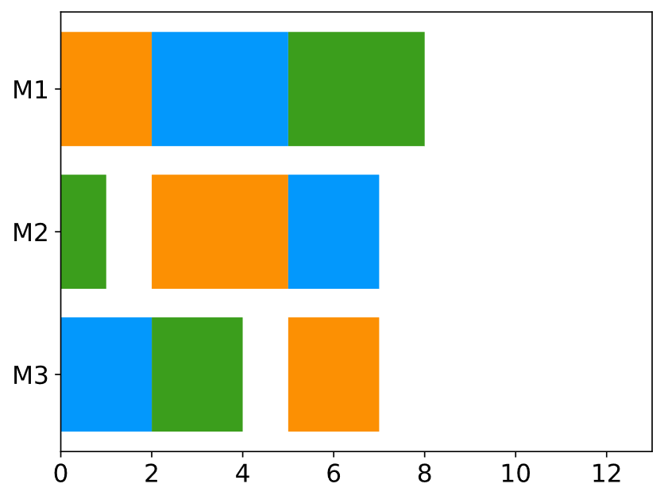

# TabuForJSSP
A tabu search algorithm and a memetic algorithm for solving the job shop scheduling problem, 
written by Laurenz, inspired by the work of Zhang et al. [1], Cheng et al. [2] and E. Balas and A. Vazacopoulos [3]. 

## In this README:
- JSSP : problem description
- About : background of the project
- Guide : dev guide
- References : the referenced papers

## JSSP
### Problem definition
The Job Shop Scheduling Problem (JSSP) is a classical NP-hard problem. Scheduling is the allocation of 
resources to tasks (or operations) in a time based environment. The JSSP is the most well known problem 
of the family of scheduling problems. The resources are called machines in this problem, time is expressed as 
integer number and the operations have job dependencies. A JSSP instance is therefore defined by a set of *n* jobs and 
*m* machines. Each job has up to m operations and can visit each machine at most once. The algorithms in this repo can
only process a more restrictive instance definition: all jobs have to visit each machine exactly once. Therefore, each
instance has *nm* operations. 
A problem description in short: 

Given:
- a set of *m* machines
- a set of *n* jobs, consisting of a sequence of operations (duration, machine)

Wanted:
- a minimal schedule - a starting time has to be assigned to each operation

Constraints:
- each operation can be started, if the predecessing operation in its job is done processing
  (starting time + duration = end time)
- each machine can only process one operation at a time

A schedule can also be seen as a timetable for each machine. 

Example instance: *[Operations: (Machine, Duration)]*

|   Job   |   Op 1    |   Op 2    |   Op 3    |  Color   |
|:-------:|:---------:|:---------:|:---------:|:--------:|
|  Job 1  |  (M1, 2)  |  (M2, 3)  |  (M3, 2)  |  orange  |
|  Job 2  |  (M3, 2)  |  (M1, 3)  |  (M2, 2)  |   blue   |
|  Job 3  |  (M2, 1)  |  (M3, 2)  |  (M1, 3)  |  green   |

Example schedule:

### Solution representation:
As already mentioned: A solution assigns a starting times to each operation. So we can see a solution as a 2-dim array 
of integers which indicate the starting time of each operation in each job. From this we can create a schedule, if we 
have the additional information (job, machine, duration) from the instance.

We use a different (maybe more intuitive) way of representation:
First, any optimal solution has a semi active solution with the same makespan. What is a semi active solution? 
A solution is semi active when all operations start as early as possible, without changing the order of the operations 
in the machines. So if we only look at semi active solutions, we reduce the solution space and also do not remove 
relevant optimal solutions if we are only searching for the best makespan. 

Given this, we can represent our solutions in the machine sequence representation, so as a sequence of jobs for each 
machine, since each job can visit each machine once at most. Therefore, we can identify each operation by its job and 
machine number. Its position in the machine sequence tells us which operations have to be finished before it is 
started, and its position in its job visa versa. So when creating a schedule from our solution representation, we 
simply go through the machine sequences check if the first unscheduled operation and schedule it if it has no pending 
job dependency.

Machine sequence solution:

| Machine |  Op 1   |  Op 2   |  Op 3   |
|:-------:|:-------:|:-------:|:-------:|
|   M1    |  Job 1  |  Job 2  |  Job 3  |
|   M2    |  Job 1  |  Job 3  |  Job 2  |
|   M3    |  Job 2  |  Job 1  |  Job 3  |

(Semi) active schedule:

## About
I am a german computer scientist and wrote these algorithms in my bachelor thesis and improved and documented
them later on. Both algorithms are strongly inspired by the work of Zhang et al. [1], Cheng et al. [2] and E. Balas and
A. Vazacopoulos [3]. My thesis is not and won't become publicly available but in short; it was about
scanning the landscape of the JSSP for good solutions and comparing a selection of them. Because I did not 
find any publicly available and well documented metaheuristics, I decided to implement some myself, because
they seemed to have superior performance to heuristic and exact approaches, when good quality solutions are
required. Therefore, I reviewed the results of many more recent papers in this area and came to the conclusion,
that those two algorithms might be suitable and could be one of the best in the desired metrics. To give you
the chance to compare your implementation of a JSSP algorithm against some well documented (and I think good)
competitors with some scientific backing.
My results showed, that Google OR Tools is pretty good at finding optimal solutions, but the Tabu 
Search was faster in finding solutions with 5%-optimality gap. Also, on some instances it could outperform 
the OR Tools formulation by far. The Memetic algorithm performed okay, so I share it anyway, but more as an 
educational example. I will share some results, an implemented Google OR Tools CP-SAT formulation in Python,
and a Python package in a repository on this profile in the future. If you have questions or problems file me
an issue on this project and I will be glad to help you. If you have improvements, make a pull request. 
But please mind: **I do all of this in my free time.**

## Guide
Two chapter. Usage if you don't care about the implementation, implementation details if you want to understand
how it works. I recommend reading both before looking into the source code. More complex parts of the algorithm 
have references in the code to the paper which explains the part. 

### Usage
For an example implementation see examples.cpp.

#### Tabu search
1. Initiate an instance of JSSPInstance (ji) with the path to the instance file as parameter (see jssp.cpp/.h)
2. Initiate a TabuSearch instance (ts) with the JSSPInstance as parameter (see ts.cpp/.h)
3. Create an initial solution with ji.generateRandomSolution()
4. Start optimization with ts.optimize() with the initial solution and a time limit (seconds) as parameter 
5. (4.) solves the instance and returns a Solution struct with the makespan, the solution as list of machine sequences
   and a list of the intermediate solution values with timestamps 

#### Memetic algorithm
1. Initiate an instance of JSSPInstance with the path to the instance file as parameter (see jssp.cpp/.h)
2. Initiate an instance of MemeticAlgorithm (mem) with the JSSPInstance as parameter
3. Start optimization with mem.optimize() with a time limit (seconds) as parameter
4. (3.) solves the instance and returns a Benchmark struct with the makespan, the solution as list of machine sequences
and a list of the intermediate solution values with timestamps

#### Additional hints
- Time limits are soft time limits. The algorithm will finish the current iteration and return afterwards if the time limit
is reached. This gets relevant especially on large instances. MemeticAlgorithm will also finish initialization, even if 
the time limit is reached earlier. 
- Both algorithms offer an iteration constraint optimization method. In this method the algorithm does not log.
- Tabu search can be started with any feasible starting solution.
- Memetic algorithm also offers the possibility to give starting solutions with optimizePopulation()
- Instances have to be in the format described in ./instances/README.md - the standard format from the OR-Library

### Implementation details
#### JSSPInstance (jssp.cpp/.h)
Utility class around the jssp instance. Provides structs Solution and BMResults for algorithm outputs. JSSPInstance 
can load and manage instances and also provides the random seed for the algorithms. All methods only work, if the instance
was initialized correctly.

#### Tabu search (ts.cpp/.h, tabu_list.h)
The Tabu search algorithm inspired by Zhang et al. [1], so if you are interested in more details on JSSP and tabu search 
on it, I strongly recommend reading their paper. Initialization takes an instance which provides the random seed,
utility methods and the data of the instance to be solved. TabuList is an additional class which provides an interface
to manage the tabu list, so prohibiting solution features, checking if a solution is prohibited and allowing solution
features again. The optimization starts by setting parameters. In the main loop each iteration it generates 
a neighbourhood so, a set of solutions which are similar to the current solution. These solutions have a change in the
longest path of the current solution, so the sequence of operations which prevents the schedule to be shorter. 
This is a good approach because the makespan can only be reduced by changing the longest path. Because we need to find 
the longest path, it is pretty intuitive to manage the solution as graph. Therefore, the algorithm manages the current
solution as a graph, called disjunctive graph. In it, each operation has an "edge" to the previous and next operation in 
its job and in its machine. This disjunctive graph is a network graph, so we are able to find the longest path using 
dynamic in a finite amount of time, unlike in a general graph, where the problem is NP-hard. Each operation is 
represented as a Node struct. The initial solution is generated at the start of the algorithm and updated each iteration
after the algorithm selected a neighbouring solution. The update reassembles the disjunctive graph so that the graph
represents the neighbour. The algorithm selects the neighbour which has the best approximated makespan and is not tabu.
The approximation technique is inspired by E. Balas and A. Vazacopoulos [3] and highly complex. I recommend reading the
paper before trying to understand my approximation methods `forwardSwap() | backwardSwap()`. 
If a neighbour has a better approximated makespan than the best 
makespan found, the makespan is calculated exact and if it is truly better, the neighbour is the next solution no 
matter if it is tabu (aspiration criterion). If all solutions are tabu, a random is selected. 

**Overview**:
1. Create initial disjunctive graph
2. Set parameters
3. Each iteration:
   1. Find longest path
   2. Find neighbours by doing swaps on the longest path -> approximate makespans
   3. Update the current solution to the best neighbour, update disjunctive graph
   4. Add solution feature to the tabu list
   5. If new best solution -> check exact makespan, if truly better -> update bestSolution
4. Time / iteration limit reached: return best solution

The process of approximating the makespans of the neighbours is pretty complex and we need to calculate the "len to n"'s 
in beforehand. "len to n" is so the longest path to a node which has no job- and machine-successor for each node of 
the disjunctive graph. Calculating the "len to n"'s is the most expensive step in the algorithm, but is crucial to approximate
makespans, which would be the most expensive task otherwise (and even more expensive of course).  

#### Memetic algorithm
The memetic algorithm is inspired by Cheng et al. [3], so if you are interested in more on memetic algorithm with tabu search on 
JSSP, I strongly recommend reading their paper. Initialization takes an instance which provides the random seed,
utility methods and the data of the instance to be solved. At start the algorithm creates an instance of tabu search,
which is used throughout the algorithm for local optimization. So the overall the memetic part does some kind of 
systematic exploitation of the solution space, while tabu search is used to converge the found solutions to the next
local optimum. For initialization the population is filled with random solutions, generated with JSSPInstance, until
it has `populationSize` solutions. Then the algorithm executes `tabuSearchIterations` iterations of tabu search on each 
solution. Afterwards the main loop starts. Here the algorithm selects two parents and tries to create better children
by combining features of both parents. The features we want to combine are the sequence of job numbers of the machines
of each parent solution. For details see `mem.ccp` -> `crossover()`. From the two selected parents, two child solutions
are created and converged to a local optimum by `tabuSearchIterations` iterations of tabu search. If a new best solution
is found the `bestSolution` is updated. Both children are added to the population. The population is than evaluated by
quality (makespan) and similarity (maximal longest common sequence length). The two worst solutions are then removed 
from the population and the next iteration starts.

**Overview**:
1. Set parameters
2. Create random start population
3. Run fixed iteration tabu search on each start solution
4. Each iteration:
   1. Select two random solutions from the population
   2. Create two children from the parents (for each machine sequence:
      1. Find longest common sequence (lcs)
      2. Copy the exact lcs of one parent into one child
      3. Fill the rest with the operations in the order of the second parent
   3. Run fixed iteration tabu search on both children
   4. Add both children to the population
   5. Evaluate population based on makespan and similarity
   6. Remove the two worst solutions
5. Return the best solution found

## Benchmark

So I benchmarked the algorithm. What did I do? 300s runtime on my laptop, build like in done in CMAKE. The instances are
classical ones. LB is the best lower bound found in the literature. The time is the time in seconds, when the algorithm 
found a solution with the best makespan it found in runtime.

| Instance | LB |   Tabu MSP    |   Tabu time    |   Mem MSP    |  Mem time   |
|:--------:|:-------:|:---------:|:---------:|:---------:|:--------:|
|   abz5   |1234|1234|268.315|1234|44.3854|
|   abz6   |943|943|0.0769613|943|0.555146|
|   abz7   |656|667|9.5619|668|145.798|
|   abz8   |648|673|111.418|678|155.642|
|   abz9   |678|692|18.1446|693|178.217|
|   ft06   |55|55|0.000803047|55|0.0781102|
|   ft10   |930|930|81.7032|930|196.258|
|   ft20   |1165|1195|0.319539|1172|112.275|
|  swv01   |1407|1494|18.5313|1470|35.6901|
|  swv02   |1475|1548|2.24155|1514|178.045|
|  swv03   |1398|1461|29.8081|1450|230.682|
|  swv04   |1464|1518|47.4382|1512|218.032|
|  swv05   |1424|1483|2.2483|1499|31.9316|
|  swv06   |1630|1722|109.119|1745|148.285|
|  swv07   |1513|1692|20.0463|1667|158.275|
|  swv08   |1671|1868|30.8872|1859|170.383|
|  swv09   |1633|1700|178.509|1708|243.476|
|  swv10   |1663|1801|62.8648|1809|282.571|
|  swv11   |2983|3556|195.861|3631|24.8543|
|  swv12   |2972|3337|72.5437|3535|51.4586|
|  swv13   |3104|3887|3.09648|3673|58.9454|
|  swv14   |2968|3614|4.19385|3581|157.065|
|  swv15   |2885|3944|76.7826|3588|112.519|
|  swv16   |2924|2924|0.0700159|2924|1.74175|
|  swv17   |2794|2794|0.0129486|2794|1.62217|
|  swv18   |2852|2853|0.20288|2852|8.98778|
|  swv19   |2843|2843|154.038|2843|5.35126|
|  swv20   |2823|2823|0.11272|2823|1.92905|

SWV 01-15 is in my experience one of the most difficult instance sets. As you can see both algorithms are not optimal.
in some cases Tabu is better, in others the Memetic algorithm. This can mostly be explained because Tabu can get stuck
in a local optimum, so memetic has a more diversity in its solutions and therefore a lower chance to get stuck in a local 
optimum. On the other hand Memetic performs "just" 12000 iterations of Tabusearch on each solution candidate and therefore 
can find worse solutions because of lack of intensification (not doing enough local search per solution candidate).

So all in all both have their shortcomings and both algorithms are neither fine-tuned nor highly optimized, but both 
offer a good approximation in moderate time.

## References
[1] `(Tabu search)` C. Zhang, P. Li, Z. Guan, and Y. Rao. A tabu search algorithm with a new neighborhood structure for the job shop scheduling problem. Computers & Operations
Research, 34:3229–3242, 2007.

[2] `(Memetic algorithm)` T. C. E. Cheng, B. Peng, and Z. Lü. A hybrid evolutionary algorithm to solve the
job shop scheduling problem. Annals of Operations Research, 242:223–237, 2016.

[3] `(Makespan approximation)` E. Balas and A. Vazacopoulos. Guided local search with shifting bottleneck for job
shop scheduling. Management science, 44(2):262–275, 1998.

